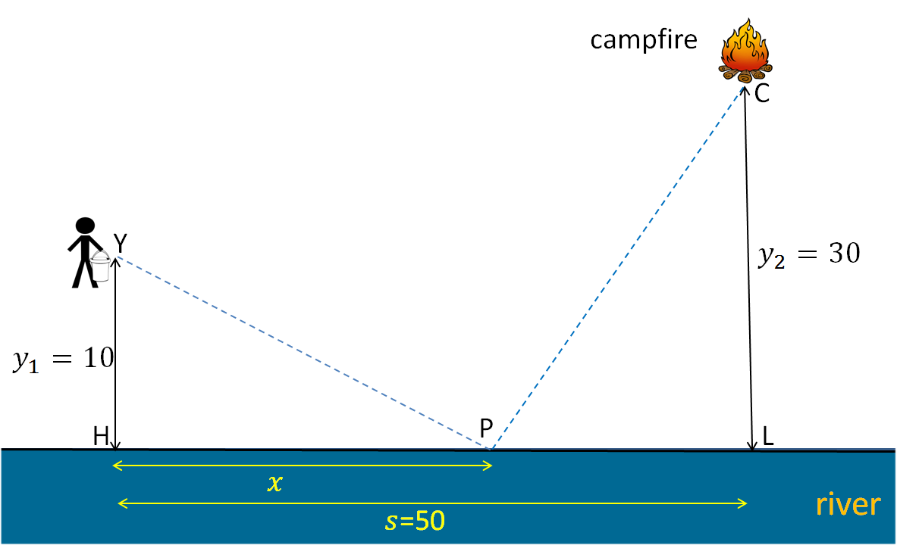

<!-- Make the font size bigger... easier for my eyes -->
<style type="text/css">

body, td {
   font-size: 16px;
}
code.r{
  font-size: 16px;
}
pre {
  font-size: 16px
}
.boxed {
  border: 1px solid black;
  padding: 5px;
} 
</style>

```{r setoptions, echo=FALSE}
# Disable the comments in R outputs
knitr::opts_chunk$set(comment = NA)
```

```{r, out.width = "600px", echo=FALSE}

```
```{r, echo=FALSE}
y1 <- 10
y2 <- 30
s <- 50
```


Suppose that you're camping near a river and you see a campfire that's getting out of hand in the distance. You have a bucket, but your bucket is empty. You know that you should run to the river with the bucket, get the water, and then run to the fire and put it out. Suppose that when you carry an empty bucket your running speed is 1.5 times of the running speed when the bucket is filled with water. What's the optimal path? Where along the river should you go to get the water so that you will reach the campfire as quickly as possible?

The geometry is shown in the diagram above. You are at a distance y1 = `r y1` units away from the river, the campfire is at a distance y2 = `r y2` units from the river. The distance between you and the campfire along the river (i.e. distance between points H and L) is s = `r s` units. You want to choose a path YPC that minimizes that the time t it takes for you to go from Y to P and then to C. Since your speed from Y to P is 1.5 times the speed from P to C, in an appropriate unit the time taken is t = d(YP)/1.5 + d(PC). Using the Pythagorean theorem, we have $d(YP)=\sqrt{x^2+y_1^2}$ and $d(PC)=\sqrt{(s-x)^2+y_2^2}$, where x is the distance between H and P. So we want to find the value of x to minimize
$$t=\frac{\sqrt{x^2+`r y1`^2}}{1.5} + \sqrt{(`r s`-x)^2+`r y2`^2} \ \ \ \ \ \ \ \ \ \ \ \ \ \ \ \ \ \ \ \ (1)$$
Here we introduce a straightforward (brute-force) method to solve this optimization problem. Suppose we want to find x to two decimal places. We know x must be between 0 and `r s`. We can try every number of 2 decimal places between 0 and `r s`, calculate the values of t and find the one x that minimizes t.

```{r, message=FALSE}
# load tidyverse packages
library(tidyverse)
```

###What is the minimum value in the vector t and the corresponding optimal value of x?

In this problem, it is useful to create a function that computes t from x:
```{r}
compute_t <- function(x) {
  sqrt(x^2+10^2)/1.5 + sqrt((50-x)^2 + 30^2)
}
```
We didn't do it in Week 2 because we hadn't covered functions at that time.

As before, we use `seq(0,50,0.01)` to construct the vector `x` containing all two decimal-place numbers between 0 and `r s`, use it to construct the `t` vector and then search for minimum `t` and the corresponding optimal value of x. With tidyverse, we can put `x` and `t` in a tibble and then take the subset of the tibble in which t is minimum:
```{r}
tibble(x = seq(0,50,0.01), t = compute_t(x)) %>% filter(t==min(t))
```
```{r, echo=FALSE}
result <- tibble(x = seq(0,50,0.01), t = compute_t(x)) %>% filter(t==min(t))
tmin <- round(result$t,2)
xopt <- result$x
```

So the minimum value of t is `r tmin` and the optimal value of x is `r xopt` (to two decimal places).

Compare this approach to the following base R solution:
```{r}
x <- seq(0,50,0.01)
t <- compute_t(x)
i <- which.min(t)
c(x[i],t[i])
```
OR use subsetting:
```{r}
x <- seq(0,50,0.01)
t <- compute_t(x)
(t_min <- min(t))
(x_optimal <- x[t==t_min])
```
The tidyverse approach is cleaner.

###Suppose you want to improve the accuracy of the calculation. Instead of two decimal places, you want to find x accurate to 4 decimal places. Repeat the calculation by trying numbers of 4 decimal places in the appropriate range and search for the minimum.

From the result of the previous question, we know the optimal x is between `r xopt-0.01` and `r xopt+0.01` So we try all 4 decimal-place numbers in that interval and then find the minimum. The command is:
```{r}
tibble(x = seq(26.12,26.14,1e-4), t = compute_t(x)) %>% filter(t==min(t))
```

<div style="color:brown;">

###Aside

As mentioned in Week 2, the brute-force approach introduced here is a quick-and-dirty way to solve this problem using techniques you already know. 

The best way to solve this optimization problem is to use R's `optimize()` function: `optimize(f, interval)` finds the minimum of a one-variable function `f` in the interval specified by the vector `interval` containing the two end-points. For our problem, we can use this command:
```{r}
optimize(compute_t, c(0,50), tol=1e-6)
```
The result is consistent with our method above. The `tol` paremeter controls the accuracy of the optimization search. I set it to 1e-6 because the default value is slightly larger than 1e-4, which is slightly worse than our method above. See `?optimize` for more information on this command. 

We didn't mention `optimize()` in Week 2 because it requires you to provide the `compute_t()` function and we hadn't covered functions at that time.

</div>

##The Pipe Operator `%>%`

You see that the pipe operator `%>%` is very useful. You will see it widely used by people using tidyverse. If you think it involves a lot of keyboard typing, you can use the RStudio shortcut Ctrl+Shift+M (Cmd+Shift+M in Mac).  While this operator is very cool, it shouldn't be abused. For example, the following is a bad use of `%>%`:
```{r}
set.seed(72671)
x <- rnorm(1000)
x %>% mean()
```
There is no reason to use `x %>% mean()` when you can simply use `mean(x)`. Even
```{r}
sqrt(sum(abs(x)))
```
is better than 
```{r}
abs(x) %>% sum() %>% sqrt()
```
in my opinion, not to mention this:
```{r}
x %>% abs() %>% sum() %>% sqrt()
```
Even worse, `()` can be omitted, resulting in an obscure code:
```{r}
x %>% abs %>% sum %>% sqrt
```
However, some people prefer this style of coding. Its structure is like a step-by-step procedure: start with vector x, take absolute value of each element, then sum over the elements, then take the square root. 

<br /><br /><br />