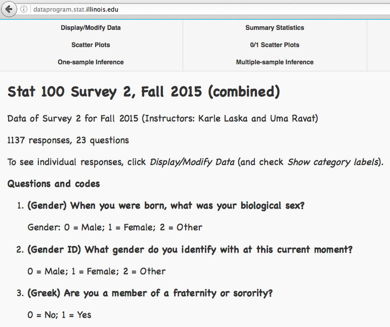

<style type="text/css">

body, td {
   font-size: 18px;
}
code.r{
  font-size: 18px;
}
pre {
  font-size: 18px
}
</style>

<!-- script type="text/x-mathjax-config">
MathJax.Hub.Config({
  TeX: { equationNumbers: { autoNumber: "all" } }
});
</script -->

```{r setoptions, echo=FALSE}
knitr::opts_chunk$set(comment = NA)
```

Here we demonstrate how to load a data file to R and perform simple manipulations. We will use the second survey data of Stat 100 classes conducted in Fall 2015 to demonstrate the process. 

You have been analyzing the Stat 100 survey data in the homework assignments. However, we have gone through the process of reformating the data before asking you to load them to R. Here we show you some of the techniques we use to reformat the data. The data in the real world are in general messier and need a lot of cleaning up before they can be analyzed. 

To download the survey data, go to Statistics Department's <a href="http://dataprogram.stat.illinois.edu/" target="_blank">data program website</a>, choose **stat100** from the first drop-down menu on the left, then choose **Survey 2, Fall 2015 (combined)**. After the data are loaded, you should see the following: 



This page lists all the questions in the survey and the coding used by the data program for the categorical data. Click the **Display/Modify Data** block on the upper left. You will enter a page that shows the data. Click the **Download Raw Data** box on the upper right of this page. Save the data '2015fall_survey02_combined.dat' to your computer. The data in each column is separated by space. 

## Load Data File to R 

To load the data file to R, first move the file to your R's working directory, or alternatively, change your R's working directory to the directory of the file. You can find out your R's current working directory using the `getwd()` command. If you forget how to set your working directory, watch one of these videos again: <a href="https://www.youtube.com/watch?v=XBcvH1BpIBo" target="_blank">Windows</a>, <a href="https://www.youtube.com/watch?v=8xT3hmJQskU" target="_blank">Mac</a>. 

Once the file '2015fall_survey02_combined.dat' is in the working directory, type 
```{r}
survey <- read.table('2015fall_survey02_combined.dat', header=TRUE)
```
to load the data to a data frame named `survey`. The `header=TRUE` option is to tell R that the first row in the file is a header and the data begin in the second row. Using the `dim()` function, we can find out the number of rows and columns of `survey`:
```{r}
dim(survey)
```
It indicates that there are 1137 observations (rows) and 23 columns. The column names are 
```{r}
names(survey)
```
When the file is loaded using the `read.table()` function with `header=TRUE`, R tries to assign the column names based on the characters in the first row. R checks the names and makes sure that they are syntactically valid variable names: variable names in R cannot contain space; they can consist of letters, numbers and the dot or underline characters and starts with a letter or the dot not followed by a number. The column names in the file '2015fall_survey02_combined.dat' contain many information that is needed for the data program, but these names are invalid variable names in R. As a result, R adjusts the names. If you want to preserve the column names as it is in the file, you can use the option `check.names=FALSE`:
```{r}
survey <- read.table('2015fall_survey02_combined.dat', header=TRUE, check.names=FALSE)
names(survey)
```


## Change Column Names

Even though the column names have now been preserved, they are still very inconvenient to use. We can change the names by assigning different names to `names(survey)`: 
```{r}
names(survey) <- c("gender","genderID","greek","homeTown","ethnicity",
                   "religion","religious","ACT","GPA","partyHr",
                  "drinks","sexPartners","relationships","firstKissAge",
                  "favPeriod","hoursCallParents","socialMedia","texts",
                  "good_well","parentRelationship","workHr",
                  "percentTuition","career")
names(survey)
```
These column names have been shortened for convenience. The detail description of each column can be found on the survey data page at the data program. 

## Looking at Data

To take a look at the data in R, type `View(survey)`. R opens a new window and displays the data in a spreadsheet.  

If we want to perform data analysis, probably the first thing we want to check is if there are missing values in the data frame. This can easily be done using the command
```{r}
sum(is.na(survey))
```
This command counts the number of NAs in the data frame, which is 0 in our case, meaning that there are no missing values.

We can look at particular rows or columns of the data in `survey` using the subsetting methods appropriate to data frames. For example, to look at the 178th row, type 
```{r}
survey[178,]
```
This command shows all columns in row 178. If we only want to look at columns 1, 4 and 5, we can type 
```{r}
survey[178,c(1,4,5)]
```
To look at the first 10 rows of column 4, type 
```{r}
survey[1:10,4]
```
Usually we don't remember what each column represents. That is why we go through the detail in setting and changing the column names. It is much easier to pull up a particular column using its column name. For example, to see the first 20 rows of the "GPA" column, type 
```{r}
survey$GPA[1:20]
```
or `survey[["GPA"]][1:20]`. These two commands are equivalent to `survey[1:20,9]` and `survey[1:20,"GPA"]` since the "GPA" column is column 9. It is also possible to create an alias to each column name without using the prefix `survey$` by the command `attach(survey)`. However, I discourage using it for beginners as it can lead to confusion. See *Good practice* in the `?attach` help page for detail. 

Column names are much easier to use when they are short and descriptive. For example, to look at the first 10 rows in columns `gender`, `ACT` and `GPA`, we can use the following command:
```{r}
survey[1:10, c("gender","ACT","GPA")]
```


Sometimes, we want to add new columns to a data frame. For example, to add a column called "one", use the command
```{r}
survey$one <- 1
```
Since "one" was not in the data frame, the above command creates a new column with the name "one". We can also 
use 
```{r}
survey[["all 2's"]] <- 2
```
to create a new column named "all 2's". When we type `names(survey)`, we see that these new columns are placed at the last two columns of the data frame:
```{r}
names(survey)
```
To remove a column from the data frame, we set it to NULL: 
```{r}
survey$one <- NULL
survey[["all 2's"]] <- NULL

names(survey)
```

Suppose we are interested in students having GPA greater than 3.8, we can use the command
```{r}
highGPA <- survey[survey$GPA > 3.8,]
```
to take a subset of the data frame for students with GPA greater than 3.8. The command 
```{r}
highGPA$GPA
```
displays the students' GPA in this new data frame. The total number of students in this group is the number of rows in `highGPA`: 
```{r}
nrow(highGPA)
```

<!--
Like columns, rows can have names too. By default,when the data are loaded to R the row names are the row numbers unless the `row.names` parameter is specified. See `?read.table` for detail. We can also set the row names using the `rownames()` command similar to the `colnames()` command illustrated above. Since our survey data is anonynmous, it is not useful to specify other row names. 
-->

### `summary()`

The function `summary(x)` shows a table summarizing the object x. For example, 
```{r}
summary(survey)
```
lists the minimum, maximum, mean and 3 quartiles in each column. (Recall that the 1st quartile is the 25th percentile, the median is the 50th percentile, and the 3th quartile is the 75th percentile.) Since some of the columns are categorical, some of the numbers are meaningless. You can compare this summary table with the one on the <a href="http://dataprogram.stat.illinois.edu/" target="_blank">data program</a>: after loading the data, click **Summary Statistics** block at the top of the page. 

The `summary()` function can also be applied to one column. For example, the command 
```{r}
summary(survey$drink)
```
summarizes the number of drinks per week for students taking the survey. The command 
```{r}
summary(survey$gender)
```
summarizes the values in the gender column. This column is categorical: "male" is represented by "0" and "female" is represented by "1". The mean of this column represents the proportion of female students in the sample:
$$mean(gender) = \frac{1}{\rm total\ number}\sum gender = \frac{\rm number\ of\ females}{\rm total\ number}$$
So we see that `r round(mean(survey$gender)*100,2)`% of the students who took the survey are female. 


### Convert Numbers to Descriptive Characters

Instead of using 0 and 1 to represent male and female, it may be more convenient to use "male" and "female" directly. It is easy to do that in R. To be safe, we copy the `survey$gender` vector to a new vector:
```{r}
gender <- survey$gender
```
Then we replace all 0's by "male" and all 1's by "female":
```{r}
gender[gender==0] <- "male"
gender[gender==1] <- "female"
```
The command `gender[gender==0]` takes the subset of the `gender` vector with the value 0. The `gender[gender==0] <- "male"` command thus replaces all 0's in `gender` to "male". Similarly, `gender[gender==1] <- "female"` replaces all 1's in `gender` to "female".

Let's check the first 10 elements of `gender` and compare them with those in `survey$gender`: 
```{r}
gender[1:10]
survey$gender[1:10]
```
This shows that we have done it correctly. We can calculate the proportion of "female" in `gender` and see if it matches the `r round(mean(survey$gender)*100,2)`% mentioned above. 
```{r}
mean(gender=="female")
```
The two proportions match, as expected. In the above command, `gender=="female"` is a vectorized operation, returning a logical vector with value TRUE for gender equal to "female" and FALSE otherwise. The command `mean(gender=="female")` then calculates the proportion of TRUE's in the logical vector `gender=="female"`.

The same trick can be applied to other categorical variables. According to the survey data page in the data program, in `survey$ethnicity`, "White" is coded as 0, "Black or African American" is 1, "Hispanic/Latino" is 2, "Asian" is 3, "Mixed" is 4, and "Other" is 5. The following code chunk change the numbers to descriptive characters:
```{r}
ethnicity <- survey$ethnicity
ethnicity[ethnicity==0] <- "White"
ethnicity[ethnicity==1] <- "Black"
ethnicity[ethnicity==2] <- "Hispanic"
ethnicity[ethnicity==3] <- "Asian"
ethnicity[ethnicity==4] <- "Mixed"
ethnicity[ethnicity==5] <- "Other"
```
If you think typing these all out one by one is tedious, you can consider doing it using a `for` loop:
```{r}
ethnicity2 <- survey$ethnicity
nums = 0:5
chars = c("White","Black","Hispanic","Asian","Mixed","Other")
for (i in seq_along(nums)) {
  ethnicity2[ethnicity2==nums[i]] <- chars[i]
}
```
The `seq_along(nums)` function is the same as `1:(length(nums))`, generating an integer sequence 1, 2, 3, ..., length(nums), or 1:6. We can check that `ethnicity` and `ethnicity2` are identical:
```{r}
identical(ethnicity,ethnicity2)
```
If you are happy with the result of the conversions, you can copy these character vectors back to the respective columns of the data frame `survey`:
```{r}
survey$gender <- gender
survey$ethnicity <- ethnicity
```

### `table()`
 
Another useful command is the `table(x)` function. It counts the numbers of each item in vector `x`. For example, `gender` is a vector containing only two categories: "male" and "female". Therefore, the command 
```{r}
table(gender)
```
counts the number of males and females in `gender`. We can convert the counts to percentages by dividing the counts by `n` (total number of students calculated above) and multiply by 100:
```{r}
n <- length(gender)
table(gender)/n*100
```
We can do the same with `ethnicity`:
```{r}
table(ethnicity)/n*100
```
This shows that the majority (49.1%) of students are White. The rest are: 26.4% Asian, 11.7% Hispanic/Latino, 7.5% Black or African American, 4% Mixed and 1.4% Other. 

Other categorical variables can be analyzed in the same way. For example, the command 
```{r}
table(survey$religion)/n*100
```
shows the percentages of students in each religion group. Since we don't convert the numeric codes to descriptive characters in this column, we have to look up the description of this survey data in the data program to see what these numbers represent: 0=Christian; 1=Jewish; 2=Muslim; 3=Hindu; 4=Buddhist; 5=Religious but not one of the above; 6=Agnostic; 7=Atheist. To make things easier, we convert them to descriptive characters. This time let's do it directly without copying to a new vector:
```{r}
nums <- 0:7
chars <- c('Christian','Jewish','Muslim','Hindu','Buddhist','Other Religion',
           'Agnostic','Atheist')
for (i in seq_along(nums)) {
  survey$religion[ survey$religion==nums[i] ] <- chars[i]  
}
```
When we run the `table()` function again, we see 
```{r}
table(survey$religion)/n*100
```
Suppose we decide that we don't like the order the summary table displays. We want to preserve the original order: 'Christian', 'Jewish', 'Muslim', 'Hindu', 'Buddhist', 'Other Religion', 'Agnostic', and 'Atheist'. One way is to convert the character vector `survey$religion` to a factor vector with the levels set to the desired order (if you forget what a factor variable is, read section 5.11 of the textbook):
```{r}
survey$religion <- factor(survey$religion, levels=c('Christian','Jewish','Muslim',
                          'Hindu','Buddhist','Other Religion','Agnostic','Atheist'))

table(survey$religion)/n*100
```
We see that the `table()` function now displays the summary in the order specified by the order of the levels. 

When the `summary()` function is applied to a factor variable, it behaves the same way as `table()`:
```{r}
summary(survey$religion)/n*100
```

The `table()` function can also be used to generate a contingency table. For example, the command 
```{r}
table(survey$religion, survey$ethnicity)
```
shows the number of students in each religion in each ethnic group. 

## Export Data to Files

We can export a data frame to a file using the `write.table()` command. For example, to export `survey` to a file named 'Stat100_Survey2_Fall2015.dat' in the working directory, type 
```{r}
write.table(survey,'Stat100_Survey2_Fall2015.dat', row.names=FALSE)
```
The option `row.names=FALSE` tells R not to include the row names, which are just row numbers in our example. By default, each column is separated by a space. 

A more commonly used data format is csv (comma separated values), where columns are separated by commas. CSV files can be opened by many software, including Excel. To export to a csv file, we specify the option `sep=','` in the `write.table()` function. Alternatively, we can use the `write.csv()` function:
```{r eval=FALSE}
write.csv(survey,'Stat100_Survey2_Fall2015.csv', row.names=FALSE)
```
The file 'Stat100_Survey2_Fall2015.csv' can be opened using Excel and you will see that it has the same column names as the data frame. The gender, ethnicity and religion columns are characters instead of integers. 

To load data from a csv file, use the `read.csv()` function:
```{r}
survey_reload <- read.csv('Stat100_Survey2_Fall2015.csv')
```
The `read.csv()` function is just the  `read.table()` function but with the default setting `sep=','` and `header=TRUE`. If you examine this data frame, you will find something interesting:
```{r}
class(survey_reload$gender)
class(survey_reload$ethnicity)
class(survey_reload$religion)
```
It is not surprising that the religion column is a factor vector since we converted it, but we see that the gender and ethnicity columns are also factors. In addition, the levels in the religion column are not in the same order as we specified above:
```{r}
levels(survey_reload$religion)
```
What is going on? It turns out that `write.table()` and `write.csv()` do not store column classes. When the file is being loaded, R converts columns containing strings to factors by default. If we want to preserve the column classes, we need to use the `save()` function: 
<p id="saverda">
```{r}
save(survey, file='Stat100_Survey2_Fall2015.RData')
```
The extension .RData is a commonly used extension for R data files. </p>

You can now quit R without worrying about losing the changes you have made. The next time you open R, type 
```{r, eval=FALSE}
load('Stat100_Survey2_Fall2015.RData')
```
to load the R data file. After typing this command, the data frame `survey` will appear in your working space. Try it! 

You can type `ls()` to see a list of variables in your working space:
```{r}
ls()
```
The command `rm(...)` deletes the variables from the working space. For example, after typing 
```{r}
rm(gender,chars,nums,survey_reload)
```
the 4 variables `gender`, `chars`, `nums` and `survey_reload` no longer exist:
```{r}
ls()
```
Since `ls()` returns a vector listing all the variables in the working space, the command 
```{r}
rm(list=ls())
```
clears all variables in the working space:
```{r}
ls()
```
If we load the R data file 'Stat100_Survey2_Fall2015.RData',
```{r}
load('Stat100_Survey2_Fall2015.RData')
```
the data frame `survey` reappears in the working space:
```{r}
ls()
class(survey)
```
The column classes, as well as the factor levels, are also the same as before:
```{r}
class(survey$gender)
class(survey$ethnicity)
class(survey$religion)
levels(survey$religion)
```
We see that the `save()` function is useful to save R objects. The drawback, however, is that it cannot be read by other software. 

Another method to save an R data to a file is to use the `dput()` function: 
```{r}
dput(survey, file='Stat100_Survey2_Fall2015.R')
```
Unlike `save()`, a file outputted by `dput()` is not in binary format. You can view the content using a text editor, although it is not meant to be read by a text editor. Since `dput()` outputs extra information such as the column classes of a data frame, the file size is larger than that outputted by `write.table()` or `write.csv()`. To load the file to R, we use the `dget()` function. Unlike `load()`, we can assign a different name for the object(s) in the file when we load the data: 
```{r}
survey2 <- dget('Stat100_Survey2_Fall2015.R')
```
Like `save()`, `dput()` preserves the data structure of the R object. So when we load the data we get exactly the same structure as the original data:
```{r}
class(survey2$gender)
class(survey2$ethnicity)
class(survey2$religion)
levels(survey2$religion)
```
To confirm that `survey2` is an exact copy of `survey`, type 
```{r}
identical(survey,survey2)
```
<br /><br />